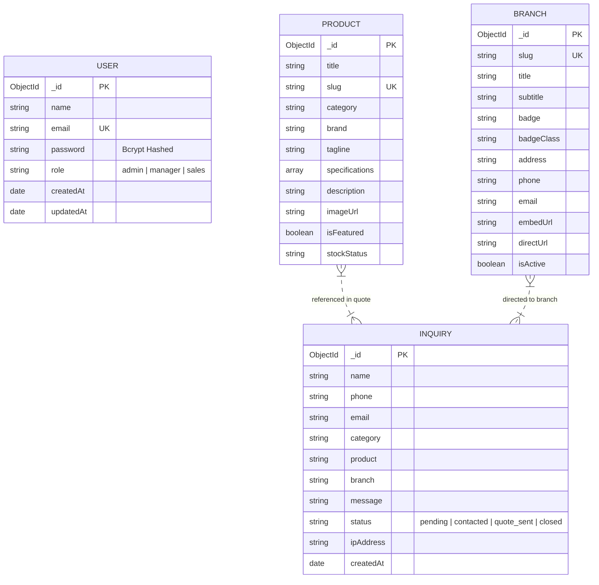

# Southern Impex — Web & System Architecture Specification

This document details the software architecture, design patterns, component hierarchy, data models, and backend REST API structure of the **Southern Impex** wholesale master supply house platform.

---

## 🏗️ High-Level System Architecture

The Southern Impex platform uses a modular, decoupled 3-tier architecture designed for maximum performance, visual impact, security, and real-time wholesale lead management.

```mermaid
graph TD
    subgraph Client ["Client Presentation Tier (Browser)"]
        PublicUI ["Public Website Views (HTML5)"]
        AdminUI ["Admin Portal Interface (admin/index.html)"]
        CSS ["Vanilla CSS Design Tokens (style.css / admin.css)"]
        JS ["ES6 JavaScript Engine (script.js / admin.js)"]
    end

    subgraph Backend ["Backend API Tier (Node.js + Express)"]
        Server ["Express HTTP Server (server.js)"]
        SecMw ["Security & CORS Middleware (Helmet, CORS, Morgan)"]
        AuthMw ["JWT Authentication & RBAC Middleware"]
        Router ["Express Domain Routers"]
        Ctrl ["API Controller Layer (Auth, Product, Inquiry, Branch)"]
    end

    subgraph Data ["Data Storage Tier (MongoDB Database)"]
        Mongoose ["Mongoose ODM Layer"]
        DB [("MongoDB Atlas / Local DB")]
    end

    PublicUI --> JS
    AdminUI --> JS
    JS -->|"HTTP / REST API (Fetch)"| Server
    Server --> SecMw
    SecMw --> Router
    Router --> AuthMw
    AuthMw --> Ctrl
    Ctrl --> Mongoose
    Mongoose --> DB
```

---

## 🎨 Presentation Layer Architecture (Frontend & Admin UI)

The presentation layer is engineered using standard Vanilla CSS design tokens (`style.css`), enforcing strict brand identity across all 12 public views and the administrative dashboard.

### CSS Design Tokens (`:root`)

```css
:root {
  /* Brand Core Colors */
  --primary-red: #D90416;       /* Brand Signature Red */
  --primary-orange: #F77F00;    /* Warm Accent Orange */
  --primary-amber: #FF9F1C;     /* High Visibility Highlight */
  
  /* Dark Mode & Surface Backgrounds */
  --bg-dark: #121212;
  --bg-dark-card: #1C1C1E;
  --bg-darker: #0A0A0C;
  --bg-card-hover: #262629;
  
  /* Glassmorphism & Borders */
  --glass-bg: rgba(255, 255, 255, 0.04);
  --glass-border: rgba(255, 255, 255, 0.1);
  --glass-card: rgba(28, 28, 30, 0.7);
  
  /* Typography */
  --font-headings: 'Poppins', sans-serif;
  --font-body: 'Inter', sans-serif;
}
```

---

## 📍 Interactive Branch Network Hub Architecture

The Branch Network Hub (`#branches`) operates as an event-driven location switching dashboard that dynamically updates without page reloads.

```mermaid
graph LR
    subgraph Controls ["User Interaction Triggers"]
        Tabs ["Segmented Tab Buttons"]
        Ticker ["Serial Bus Ticker Items"]
    end

    subgraph Engine ["JavaScript State Controller"]
        State ["updateBranchView(branchId)"]
        DataMap ["branchDataMap (Dict)"]
    end

    subgraph DOM ["Dynamic View Updates"]
        Info ["Left Panel (Badge, Address, Phone)"]
        GNav ["Get Directions Button (GPS Deep Link)"]
        Map ["Right Viewport (Google Maps Embed Iframe)"]
    end

    Tabs --> Engine
    Ticker --> Engine
    Engine --> DataMap
    DataMap --> Info
    DataMap --> GNav
    DataMap --> Map
```

---

## 🔄 Event-Driven JS Engines (`script.js` & `admin.js`)

1. **Header Scroll & Active Nav Highlighter**: Listens to `window.scroll`, toggles `.scrolled` state on header, and calculates active section thresholds.
2. **Category & Gallery Filter**: Client-side card filtering using `data-category` attributes with smooth CSS transitions.
3. **Quote Modal Dialog Engine**: Global dialog state manager controlling open/close, locking body scroll, and auto-selecting requested product item.
4. **Toast Notification System**: Dynamic DOM injection for instant user feedback upon form submission.
5. **Admin Portal Controller (`admin.js`)**: Manages JWT lifecycle (`localStorage`), authenticates admin users, fetches inquiry tables, handles lead status updates (`pending`, `contacted`, `quote_sent`, `closed`), and handles product inventory CRUD operations.

---

## 🗄️ Backend REST API Architecture (Node.js + Express)

The backend is built as a RESTful JSON API using Node.js, Express.js, and Mongoose ODM.

### System Layer Architecture

```mermaid
graph TD
    Req ["HTTP Request"] --> Security ["Helmet & CORS Middleware"]
    Security --> Logging ["Morgan Logging"]
    Logging --> Parser ["Body Parser (express.json)"]
    Parser --> Routing {"Route Routing"}
    
    Routing -->|"/api/auth"| AuthRoutes ["Auth Router"]
    Routing -->|"/api/inquiries"| InquiryRoutes ["Inquiry Router"]
    Routing -->|"/api/products"| ProductRoutes ["Product Router"]
    Routing -->|"/api/branches"| BranchRoutes ["Branch Router"]
    
    AuthRoutes --> AuthCtrl ["Auth Controller (JWT & Bcrypt)"]
    InquiryRoutes --> InquiryCtrl ["Inquiry Controller"]
    ProductRoutes --> ProductCtrl ["Product Controller"]
    BranchRoutes --> BranchCtrl ["Branch Controller"]
    
    AuthCtrl --> DB models
    InquiryCtrl --> DB models
    ProductCtrl --> DB models
    BranchCtrl --> DB models
```

---

## 💾 Mongoose Data Schemas (Database Models)



### Model Specifications

1. **User Model (`User.js`)**: Secure admin user storage with Mongoose `pre('save')` hooks for automatic password salting and hashing (`bcryptjs`), and instance method `matchPassword()`.
2. **Product Model (`Product.js`)**: Catalog schema storing product title, slug, category, brand, tagline, key-value specification pairs, images, and inventory stock availability.
3. **Inquiry Model (`Inquiry.js`)**: Customer lead record containing quote requests, contact numbers, selected branch, status tracking (`pending`, `contacted`, `quote_sent`, `closed`), and submitter IP tracking.
4. **Branch Model (`Branch.js`)**: Network location metadata including name, address, direct phone lines, Google Maps iframe embed URLs, and direct GPS navigation links.

---

## 🔒 Security & Performance Engineering

- **Authentication & Authorization**: Stateless JWT (JSON Web Token) authentication with bearer authorization headers.
- **HTTP Security Headers**: Express `helmet()` integration protecting against XSS, clickjacking, and MIME-type sniffing.
- **Cross-Origin Resource Sharing**: Configured `cors()` allowing controlled origin access.
- **Zero Heavy Dependencies**: Frontend engineered without bulky client-side frameworks, ensuring near-instant DOM loads.
- **Responsive & Accessible**: Fully semantic HTML5 structure with ARIA tags and optimized color contrast ratios.
