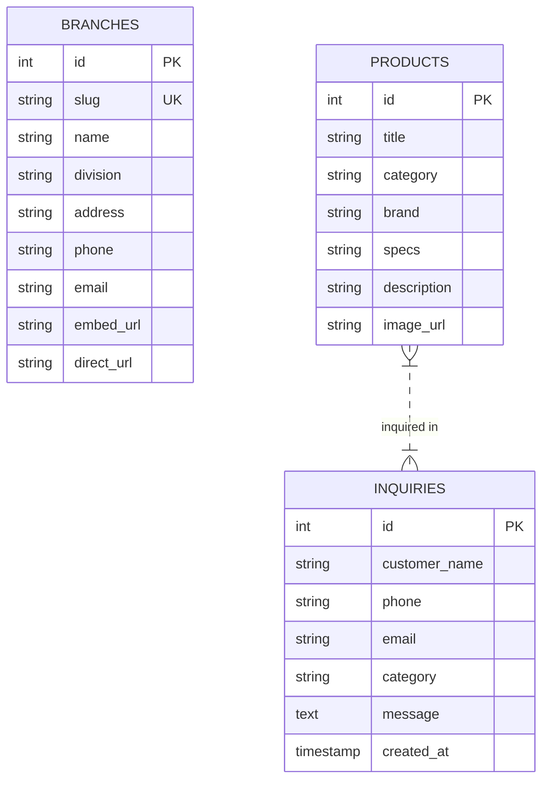

# Southern Impex — Web System Architecture Specification

This document details the software architecture, design patterns, component hierarchy, and data flow of the **Southern Impex** web application platform.

---

## 🏗️ High-Level System Architecture

The Southern Impex web application uses a modular, decoupled tier structure designed for high performance, visual excellence, and seamless customer interaction.

```mermaid
graph TD
    subgraph Client ["Client Browser (Frontend Presentation Layer)"]
        UI ["HTML5 Semantic Views"]
        CSS ["Vanilla CSS Design System (style.css)"]
        JS ["ES6 JavaScript Engine (script.js)"]
    end

    subgraph Modules ["Frontend UI & Interactive Modules"]
        Hero ["Cinematic Video Hero"]
        BranchHub ["Unified Branch Network Hub & Maps"]
        Catalog ["Product Catalog & Category Filters"]
        Modal ["Quote Request Dialog System"]
        Toast ["Toast Notification Engine"]
        Counter ["IntersectionObserver Stats Counter"]
    end

    subgraph External ["External Services Layer"]
        GMaps ["Google Maps Embed API"]
        GNav ["Google Maps Navigation Link"]
    end

    subgraph Backend ["Backend Tier (Laravel + MySQL)"]
        API ["Laravel RESTful API"]
        DB [("MySQL Database")]
    end

    Client --> Modules
    JS --> BranchHub
    BranchHub --> GMaps
    BranchHub --> GNav
    Modules --> API
    API --> DB
```

---

## 🎨 Presentation Layer Architecture (Frontend Design System)

The presentation layer is engineered using a custom Vanilla CSS tokenized design system (`style.css`), enforcing consistent visual identity across all views.

### CSS Design Tokens (`:root`)
- **Primary Colors**:
  - `--primary-red`: `#D90416` (Brand Signature Red)
  - `--primary-orange`: `#F77F00` (Warm Accent Orange)
  - `--primary-amber`: `#FF9F1C` (High Visibility Highlight)
- **Dark Mode Backgrounds**:
  - `--bg-dark`: `#121212`
  - `--bg-dark-card`: `#1C1C1E`
  - `--bg-darker`: `#0A0A0C`
- **Typography Tokens**:
  - `--font-headings`: `'Poppins', sans-serif` (Bold geometric headers)
  - `--font-body`: `'Inter', sans-serif` (High readability body font)
- **Glassmorphism Tokens**:
  - `--glass-bg`: `rgba(255, 255, 255, 0.04)`
  - `--glass-border`: `rgba(255, 255, 255, 0.1)`

---

## 📍 Interactive Branch Network Hub Architecture

The Branch Network Hub (`#branches`) is designed as a unified, compact, high-efficiency location switching dashboard.

```mermaid
graph LR
    subgraph Controls ["User Interactive Triggers"]
        Tabs ["Segmented Tab Buttons"]
        Ticker ["Serial Bus Ticker Items"]
    end

    subgraph Handler ["JavaScript State Controller"]
        State ["updateBranchView(branchId)"]
        DataMap ["branchDataMap (Dict)"]
    end

    subgraph View ["DOM View Updates"]
        Info ["Left Info Panel (Badge, Address, Phone)"]
        DirectLink ["Get Directions Button (URL)"]
        Iframe ["Right Map Viewport (Google Maps Embed)"]
    end

    Tabs --> Handler
    Ticker --> Handler
    Handler --> DataMap
    DataMap --> Info
    DataMap --> DirectLink
    DataMap --> Iframe
```

### Branch Data Schema (`branchDataMap`)
Each branch entity is registered with structured metadata:
- `title`: Branch commercial name.
- `subtitle`: Functional division tag (e.g., Head Office, Sign Tech, Malabar Hub).
- `badge` & `badgeClass`: Visual tag styling (`hq`, `tech`, `calicut`, `tvm`).
- `address`: Detailed street address with pincode.
- `phone`: Primary trade desk and hotline contact numbers.
- `embedUrl`: Google Maps embed iframe URL query.
- `directUrl`: Google Maps deep link for direct GPS navigation.

---

## 🔄 Event-Driven JS Architecture (`script.js`)

The JavaScript engine is structured around DOM event delegation and browser APIs:

1. **Header Scroll & Nav Active Highlighter**: Listens to `window.scroll`, toggles `.scrolled` state on header, and updates active menu highlights based on section thresholds.
2. **Category & Gallery Filtering**: Client-side filtering hiding/showing product cards using `data-category` and CSS fade animations.
3. **Quote Modal Controller**: Global dialog handling opening/closing modals, disabling body scrolling during active modal state, and auto-populating product select options.
4. **Toast Notification System**: Dynamic DOM injection for instant user feedback upon form submission.
5. **IntersectionObserver Counter**: Triggers numeric counter animation when the stats section scrolls into view.

---

## 🗄️ Backend Data Architecture (Laravel + MySQL)

The system is prepared for backend integration using Laravel's MVC pattern:



---

## ⚡ Performance & SEO Optimizations

- **Semantic HTML5**: Single `<h1>` per view with strict heading hierarchy.
- **Lazy Loading**: `loading="lazy"` on map iframes and images.
- **Zero Heavy Dependencies**: Built with zero external JS frameworks for instant page render times.
