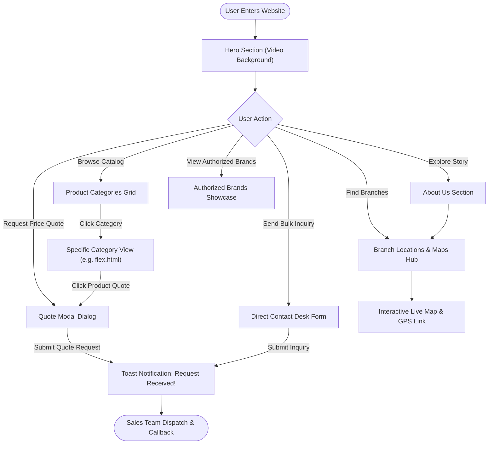
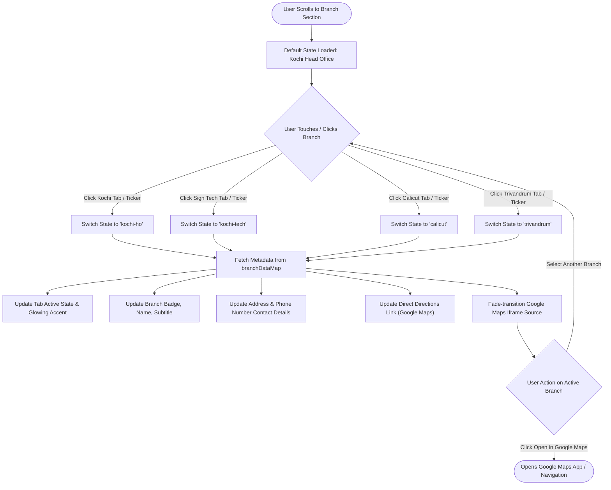
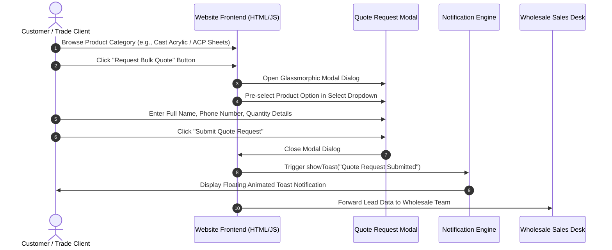
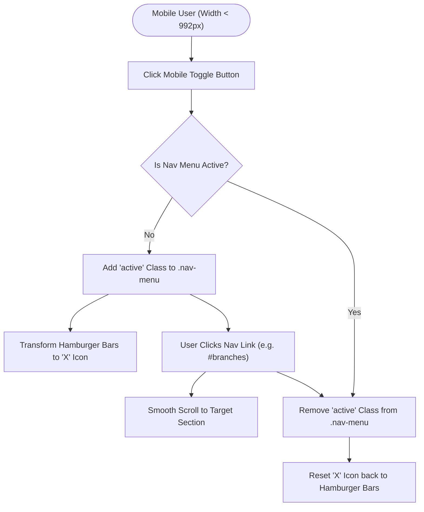

# Southern Impex — User Experience & Feature Flowcharts

This document outlines the complete user journey, page navigation flows, and interactive component state diagrams using Mermaid flowcharts.

---

## 🗺️ 1. Master Site Navigation & User Journey Flow

---

## 📍 2. Interactive Branch Network Hub Flow

This flowchart illustrates how user touches/clicks on the Branch Selector Pills or the Serial Bus Ticker dynamically update the Branch Hub view without page reloads.

---

## 📩 3. Product Catalog & Quote Request Modal Sequence Flow

---

## 📱 4. Mobile Navigation Menu Toggle Flow

