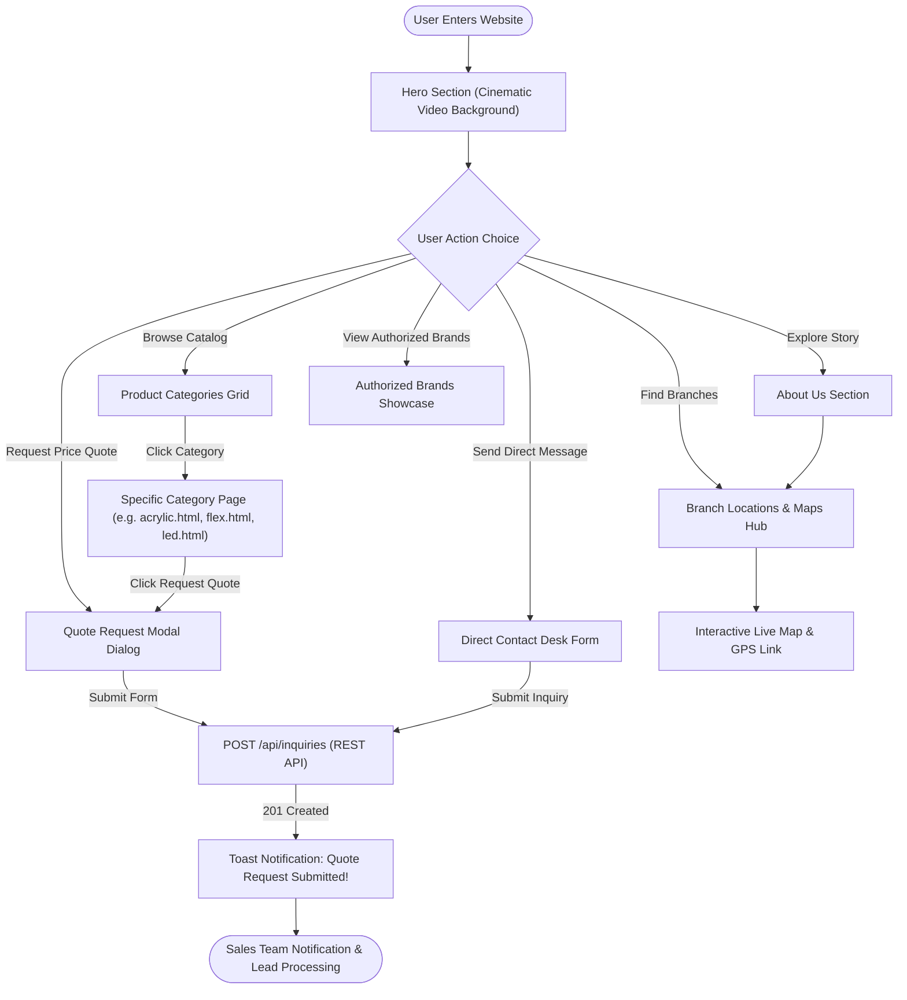
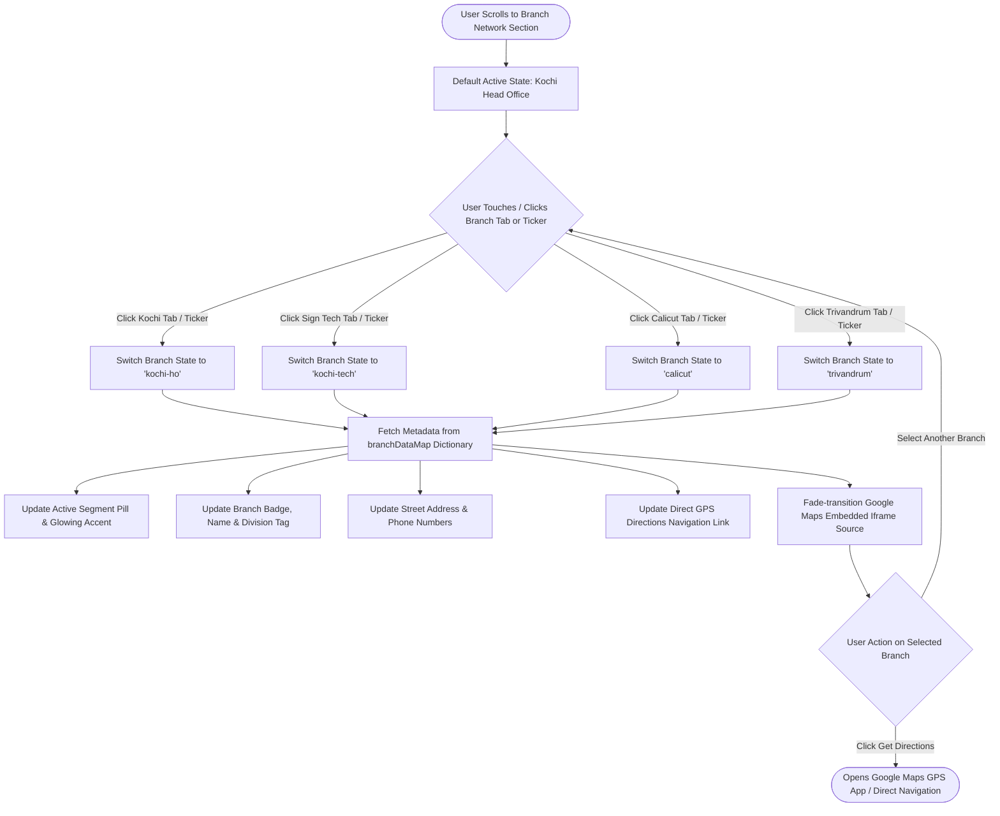
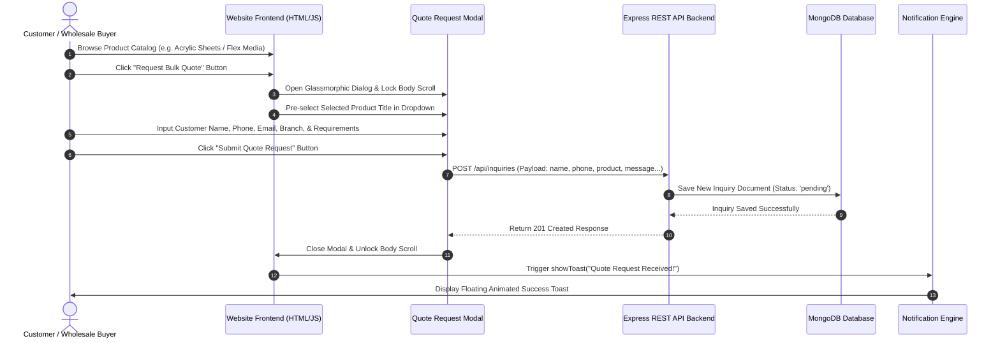
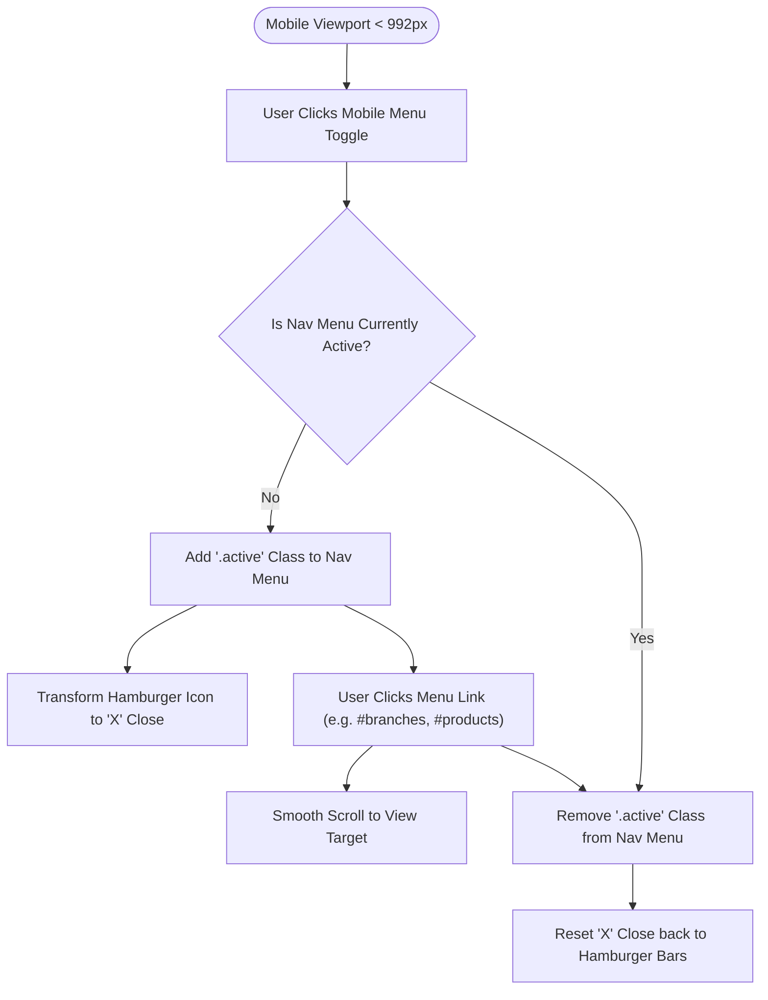
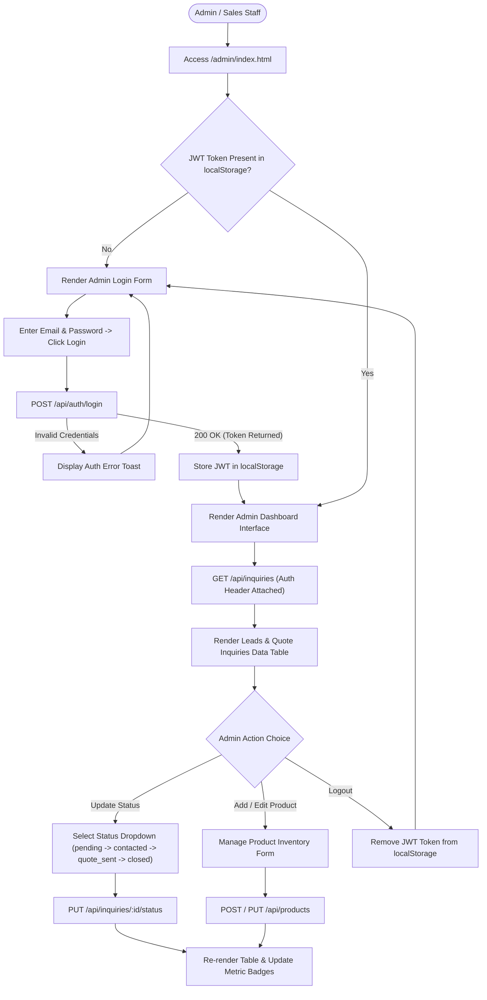
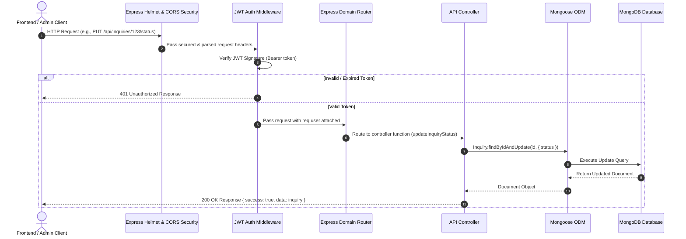

# Southern Impex — User Experience, System & API Flowcharts

This document details the user journeys, page navigation flows, component state transitions, admin lead processing lifecycle, and backend REST API data flows using Mermaid flowcharts.

---

## 🗺️ 1. Master Site Navigation & User Journey Flow

---

## 📍 2. Interactive Branch Network Hub Switching Flow

---

## 📩 3. Product Catalog & Quote Request Modal Sequence Flow

---

## 📱 4. Mobile Navigation Menu Toggle & Responsive Flow

---

## 🔐 5. Admin Authentication & Lead Processing Lifecycle Flow

---

## ⚡ 6. End-to-End REST API Request-Response Lifecycle Flow

